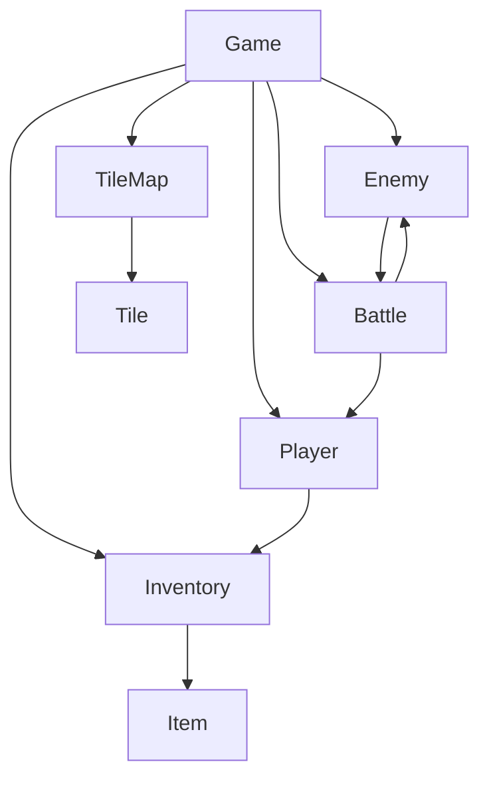

# UML Documentation

## Main Class Diagram

## Description
- **Game**: Central controller, manages state and flow
- **Player**: Player character, stats, inventory
- **Enemy**: Monster stats and behavior
- **Battle**: Handles combat between player and enemy
- **Inventory**: Manages items
- **TileMap**: World and dungeon layout
- **Item**: Usable objects
- **Tile**: Map tiles

---
For more details, see Design.md and GDD.md.
